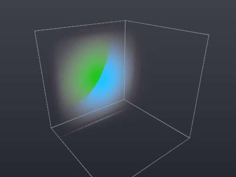

# diaphane

**Watch light move.**

Diaphane solves Maxwell's curl equations on a 3D Yee grid and keeps the solver
and the renderer in the same GPU memory, so the fields are something you look
at while they evolve rather than something you post-process afterwards.

A word on what you will actually see, because the obvious claim is false: a
travelling wave does **not** show the two fields trading energy. `E` and `H`
are perpendicular as vectors, but they are co-located and in phase, and their
energy densities are *equal* — that is equipartition, and there is a test
asserting it. They travel locked together. The trade is a standing-wave
phenomenon, where the two sit a quarter wavelength apart and 90° out of phase:

```
cargo viz                     # a packet crossing free space — sheets, locked in phase
cargo viz --scene cavity      # a ringing box — the two fields alternating
cargo render --gif out.gif    # the same views, to a GIF or PNGs, no display
```



*Signed `Ez` warm and `Hy` cool, 80³ cells, five solver steps a frame. Made
with `cargo render --gif`, which is the same renderer the window uses.*

Those flat sheets are wavefronts, and the fields really do sit on top of each
other there — perpendicular as vectors, but co-located and in phase, so no
picture of *magnitude* can pull them apart. `--mode ribbons` plots them instead:
`E` out one axis, `H` out the perpendicular one, both against the direction of
travel. It is the textbook figure, drawn from the solver's own data, and the
only view in which the right angle is visible — because a right angle is a fact
about direction, and direction has to be plotted to have a place.

The window adds a control panel: transport, a scrub slider over the whole run,
view mode, brightness, and the throughput numbers. Stepping backwards is a
replay from the nearest keyframe rather than an inverse update — the GPU solver
only runs forwards — so it is exact everywhere and instant inside the keyframe
window, which the panel marks.

Built on [`blade-graphics`](https://github.com/kvark/blade).

## Scenes

A scene is data, not a program: geometry, materials, sources and boundary in a
commented [RON](https://github.com/ron-rs/ron) file. Everything is in **metres,
from the centre of the domain**, so a scene is not welded to the resolution it
was written at — `Scene::with_resolution` rediscretizes it without moving
anything, which makes "run it at 2× and check the answer stopped changing" one
call.

```
cargo viz --scene scenes/double-slit.ron
cargo render --scene cavity --save-scene mine.ron
```

[`scenes/`](scenes) has six worked examples — free flight, a conducting cavity,
a glass slab, a metal sphere, Young's double slit, and a subwavelength film on
a graded grid — each commented with what it shows and what to look at.

## Cells are boxes, not cubes

Each axis carries its own list of cell widths, so a scene can ask for
resolution where the physics is small and not pay for it everywhere:

```ron
refinements: [
    // 0.1 mm across the film; y and z opt out with a zero size.
    Refinement(center: (0.0, 0.0, 0.0), size: (0.008, 0.0, 0.0), cell_size: 0.0001),
],
max_ratio: 1.15,
```

This is deliberately the *cheap* end of adaptive refinement. A hierarchy of
patches buys locality that a tensor product cannot, and costs interpolation at
every interface, spurious reflection off it, and late-time instability that
takes tens of thousands of steps to show. A graded dense grid has none of
those — it stays a plain symmetric leapfrog — and gives up locality instead:
refining a box refines the slabs it projects onto, all the way through. Right
for films, layered stacks, wires and boundary layers.

The grading is capped at 1.15× between neighbouring cells, because a centred
difference is only centred where the spacing is not moving. A graded run agrees
with a uniformly fine one to 0.6% of peak, and a graded lossless box holds its
energy over 20,000 steps.

The honest cost: a change of spacing is a change of numerical phase velocity,
so a wave crossing one partially reflects off nothing physical. Measured at
**−32.5 dB** at the default cap — about 25 dB louder than the absorbing walls,
which makes the mesh the loudest artifact in a refined scene. Grading at 1.05
instead measures −52.4 dB and costs about a third of the cell saving. That is
why `max_ratio` is in the scene file.

## Time

The state is a pure function of `(scene, step)`. Nothing is random, sources are
analytic, so any step can be reproduced rather than recorded. That gives two
independent ways to move backwards:

- **Keyframes.** [`Timeline`](src/timeline.rs) snapshots the fields
  periodically; seeking restores the nearest earlier one and replays. That is
  what the scrub bar along the bottom of the window drags. 24 bytes per cell
  per keyframe, so a long run gets a *window* rather than a full history.
- **Reversal.** Leapfrog is an exact involution, so the solver runs backwards
  with no memory at all — in a lossless box. Through the absorbing layer it
  amplifies by 3× per step, so `reverse` refuses rather than returning an
  exponentially growing field.

## What is here

One crate, and it is the solver. The library is headless under **every**
feature, not merely by default: `winit` and `png` are dev-dependencies, so
there is no switch anyone can throw that puts a window system into a dependency
graph containing `diaphane`. CI asserts that with `--all-features` rather than
trusting it.

The visualizer is two examples, which is what makes that true:

| | |
|---|---|
| `cargo viz` | the viewer: a window, an orbit camera, and a control panel. |
| `cargo render` | the same view, written to PNGs or a GIF. Needs no display. |

They share the render pass and their command line, and nothing else — one needs
an event loop and a surface, the other needs neither, which is what lets CI run
the second on a headless machine and the first under Xvfb.

The solver comes in two implementations of the same physics. `diaphane::gpu` is
the blade compute pipeline and is the one that has to be fast.
`diaphane::cpu` is a plain-loops reference: it gives the validation suite
something to run without a GPU, it gives the shader an oracle to be checked
against, and it gives the benchmarks an honest baseline against the CPU-resident
solvers that exist in the Rust ecosystem today.

## The physics

Full-vector 3D FDTD — `Ex, Ey, Ez, Hx, Hy, Hz` on the standard Yee staggering,
leapfrogged in place, `f32` throughout.

Fields are impedance-normalized (`Ẽ = √(ε₀/μ₀)·E`), which makes the two curl
updates structurally identical and keeps both fields in the same numeric range.
Materials are a per-cell `u32` index into a small coefficient table, so
repainting geometry never means recomputing coefficients. Boundaries are either
perfectly conducting walls or a graded, impedance-matched absorbing layer whose
profile is separable and therefore costs three 1D arrays rather than a field.

The conventions that are easy to get wrong — which sample sits at which
half-cell, which difference is forward and which is backward — are written down
in [`src/grid.rs`](src/grid.rs) and referred to from everywhere else. Every FDTD bug is an off-by-half.

## Validation

`cargo test` runs 107 checks without needing a GPU, and the ones worth naming
are the ones that could not pass by accident: an **exact discrete plane wave**
seeded and required to propagate exactly — not a discretized continuum
solution, a solution of the stepping scheme itself; **numerical phase velocity**
against the analytic dispersion relation, with a negative control; **energy
conservation** over 40,000 steps in a PEC box; **absorbing-layer reflection**
measured at −58 dB against an oversized reference domain; and **CPU/GPU parity**
wherever a Vulkan or Metal device exists.

Nothing here is exercised only by compiling it. CI runs the solver on lavapipe,
the offscreen renderer headless, and the windowed viewer under Xvfb, and
cross-checks the Metal backend from Linux.

## Benchmarks

FDTD is bandwidth-bound, so the unit is cell-updates per second. On the same
48³ free-space problem, single-threaded, diaphane runs at about **2.5×**
[`oxiphoton`](https://crates.io/crates/oxiphoton) — and most of that is a design
choice (`f32` and a matched lossy layer against `f64` and CPML, roughly 6× the
bytes per cell) rather than better code. Converting only part of a 6× traffic
advantage into 2.5× of speed means there is headroom left on our side.
[`docs/benchmarks.md`](docs/benchmarks.md) has the numbers and what is
deliberately not being compared.

```
cargo bench
```

## Documentation

- [`docs/design.md`](docs/design.md) — the original design brief
- [`docs/architecture.md`](docs/architecture.md) — what was built, and where it
  departs from that brief and why
- [`docs/benchmarks.md`](docs/benchmarks.md) — measured throughput, and what the
  comparison does and does not mean
